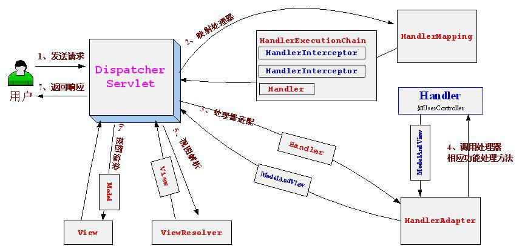
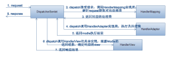

MVC框架实现

1.MVC（Model—View—Controler)介绍

MVC模式最早由Trygve Reenskaug在1978年提出，是施乐帕罗奥多研究中心（Xerox PARC）在20世纪80年代为程序语言Smalltalk发明的一种软件设计模式。当前备受推崇的一种设计模式，更是web项目的标配。

MVC强制将程序的input、process和output分割独立分别由对应的mvc组建负责。控制器接受用户的请求，调用相应的模型来进行业务处理，并返回数据给控制器。控制器调用相应的视图来显示处理的结果。并通过视图呈现给用户。

优点：

	MVC模式的目的是实现动态的程序设计开发，使得开发或维护过程中对程序的修改和扩展变得更加简单，
	程序的复用性变得更好。
	提高了程序的灵活性和可配置性。
	程序结构更加直观。
	各个组建对应功能明确，开发人员能够更好的发挥所长分工作业。

缺陷：

	技术论坛里，时不时会有MVC已死的声音。现在如日中天的MVC是否真的廉颇老矣？这里摘取《Object Design: Roles, Responsibilities, and Collaborations》一书中对MVC集中式控制器总结了一下四大缺点：
	
	Control logic can get overly complex.
	
	控制器会变得复杂，很多人在Struts的Action控制器中写业务代码已经变得很常见。
	
	Controllers can become dependent on information holders' contents.
	
	控制器变得依赖信息数据中心或数据库了，控制器做很多事情。
	
	Objects can become coupled indirectly through the actions of their controller.
	
	对象将间接地通过控制器的action耦合在一起，一个对象在控制器中查询获得，然后复制给另外一个对象，这两个对象就耦合在一起。
	
	The only interesting work is done in the controller.
	
	唯一有趣的工作是做控制器，Responsibilities职责被吸进控制器对象，只将一些行为留给角色模型完成，重要的事情都集中在控制器中了。
	
	传说中的替代架构：DCI(Data Context Interactions)

2. 流行实现框架分析

	闲话休多，好与坏都需要自己亲身去实践，需要透彻的了解这种设计。本篇文章旨在通过参考现今主流MVC框架的设计思路自己实现一个简单的mvc框架，从而更加深入透彻的理解与掌握MVC。

	首先简单分析一下流行的MVC框架 如struts2 和 springmvc

Struts2
请求流程：

struts request 流程图
上面这张图是官方给出的struts2.0请求处理流程图，struts2.0对一个请求的处理可以分为以下几个步骤：

	客户端发送请求。
	
	请求先通过ActionContextCleanUp-->FilterDispatcher。
	
	FilterDispatcher通过ActionMapper来决定这个Request需要调用哪个Action。
	
	如果ActionMapper决定调用某个Action，FilterDispatcher把请求的处理交给ActionProxy，这儿已经转到它的Delegate—Dispatcher来执行。
	
	ActionProxy根据ActionMapping和ConfigurationManager找到需要调用的Action类
	
	ActionProxy创建一个ActionInvocation的实例。
	
	ActionInvocation调用真正的Action，当然这涉及到相关拦截器的调用。
	
	Action执行完毕，ActionInvocation创建Result并返回，当然，如果要在返回之前做些什么，可以实现PreResultListener。添加PreResultListener可以在Interceptor中实现。

springmvc
请求流程：

 
具体流程步骤如下：

	1. 首先用户发送请求=>DispatcherServlet，前端控制器收到请求后自己不进行处理，而是委托给其他的解析器进行处理，作为统一访问点，进行全局的流程控制。
	
	2. DispatcherServlet=>HandlerMapping， HandlerMapping将会把请求映射为HandlerExecutionChain对象（包含一个Handler处理器（页面控制器）对象、多个HandlerInterceptor拦截器）对象，通过这种策略模式，很容易添加新的映射策略。
	
	3. DispatcherServlet=>HandlerAdapter，HandlerAdapter将会把处理器包装为适配器，从而支持多种类型的处理器。
	
	4. HandlerAdapter=>处理器功能处理方法的调用，HandlerAdapter将会根据适配的结果调用真正的处理器的功能处理方法，完成功能处理；并返回一个ModelAndView对象（包含模型数据、逻辑视图名）。
	
	5. ModelAndView的逻辑视图名=> ViewResolver， ViewResolver将把逻辑视图名解析为具体的View。
	
	6. View=>渲染，View会根据传进来的Model模型数据进行渲染，此处的Model实际是一个Map数据结构，因此很容易支持其他视图技术；
	
	7. 返回控制权给DispatcherServlet，由DispatcherServlet返回响应给用户，流程结束。

3. 实现

经过对struts2和springmvc的分析，可以看出要实现mvc这样的表现层框架，总体上来说需要实现以下三点：

URL到框架的映射。

Http请求参数绑定。

Http响应的生成和输出。

将其具体到实现可以分为：

配置元素的对象化（解析配置文件，初始化环境）。

	publicvoid init() throws ServletException {
	
	super.init();
	
	try {
	
	actionConfigs = XMLUtil.parseConfig();
	
	} catch (Exception e) {
	
	e.printStackTrace();

	}
	
	}

2. 对Http请求进行初步处理，查找与之对应的处理类（方法）

		String handlerMappingClassName = handlerBeanConfigs.get(Constants.HAND LER_MAPPING).getClazz();
		
		String actionName = ((HandlerMapping)
		
		ReflectUtil.getInstance(handlerMappingClassName)).handlerMapping(req);

3. 调用相应的处理类（方法）完成业务逻辑对处理类（方法）

		ActionConfig actionConfig = actionConfigs.get(actionName);
		
		String handlerAdapterClassName = handlerBeanConfigs.
		
		get(Constants.HANDLER_ADAPTER).getClazz();
		
		String result = ((HandlerAdapter)ReflectUtil.
		
		getInstance(handlerAdapterClassName))
		
		.handlerAdapter(req, actionConfig, actionName);

4. 根据处理类（方法）的调用结果，进行Http响应处理

		String handlerViewClassName = handlerBeanConfigs.
		
		get(Constants.HANDLER_VIEW).getClazz();
		
		((HandlerView) ReflectUtil.getInstance(handlerViewClassName)).
		
		handlerView(req, resp, actionConfig, result);

以上是整个框架处理的核心流程,核心流程的控制在DispatcherServlet类中完成。同时整个流程又分为以上的几个步骤，对于每个步骤的具体实现,采用开放接口的方式提供给框架使用者。可以实现其中的对应接口,并在配置文件中注册具体实现类。即可实现修改框架默认定制属于自己实现。

具体提供以下三个接口分别对应上面2，3，4步的处理逻辑，分别为：

HandlerMapping

HandlerAdapter

HandlerView

 

扩展举例：实现定制Http请求进行初步处理，查找与之对应的处理类（方法）

	publicclass HandlerURLMapping implements HandlerMapping {
	
	@Override
	
	public String handlerMapping(HttpServletRequest request) throws Exception {
	
	String contextPath = request.getContextPath();
	
	String uri = request.getRequestURI();
	
	String actionName = uri.substring(contextPath.length() + 1, uri.length());
	
	return actionName;
	
	}
	
	}

框架request请求执行逻辑图如下：

